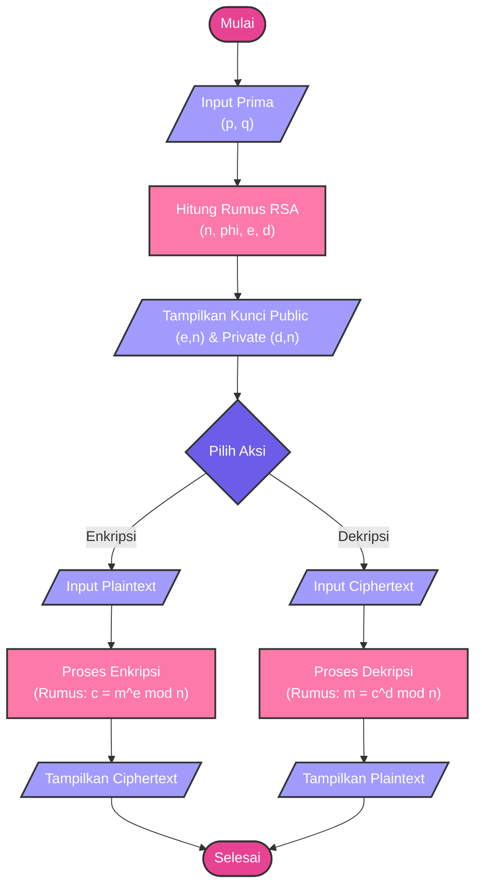

```mermaid


flowchart TD
    %% --- 1. SETUP & GENERATE KEYS ---
    Start([Mulai]) --> InputPQ[/"Input Prima
    (p, q)"/]
    InputPQ --> GenProcess["Hitung Rumus RSA
    (n, phi, e, d)"]
    GenProcess --> OutputKeys[/"Tampilkan Kunci Public (e,n) & Private (d,n)"/]

    %% --- 2. PERCABANGAN (ENKRIPSI / DEKRIPSI) ---
    OutputKeys --> Menu{Pilih Aksi}

    %% --- JALUR A: ENKRIPSI ---
    Menu -->|Enkripsi| InputPlain[/"Input Plaintext"/]
    InputPlain --> EncProcess["Proses Enkripsi
    (Rumus: c = m^e mod n)"]
    EncProcess --> OutputCipher[/"Tampilkan Ciphertext"/]

    %% --- JALUR B: DEKRIPSI ---
    Menu -->|Dekripsi| InputCipher[/"Input Ciphertext"/]
    InputCipher --> DecProcess["Proses Dekripsi
    (Rumus: m = c^d mod n)"]
    DecProcess --> OutputPlain[/"Tampilkan Plaintext"/]

    %% --- ENDING ---
    OutputCipher --> Finish([Selesai])
    OutputPlain --> Finish([Selesai])

    %% --- STYLING FEMINIM (Cotton Candy Theme) ---
    %% Start & Finish: Hot Pink / Raspberry
    style Start fill:#e84393,stroke:#333,stroke-width:2px,color:white
    style Finish fill:#e84393,stroke:#333,stroke-width:2px,color:white

    %% Menu: Deep Purple / Violet
    style Menu fill:#6c5ce7,stroke:#333,stroke-width:2px,color:white

    %% Proses (Kotak Persegi): Soft Pink / Bubblegum
    style GenProcess fill:#fd79a8,stroke:#333,stroke-width:2px,color:white
    style EncProcess fill:#fd79a8,stroke:#333,stroke-width:2px,color:white
    style DecProcess fill:#fd79a8,stroke:#333,stroke-width:2px,color:white

    %% Input/Output (Jajargenjang): Soft Lavender / Lilac
    style InputPQ fill:#a29bfe,stroke:#333,stroke-width:2px,color:white
    style OutputKeys fill:#a29bfe,stroke:#333,stroke-width:2px,color:white
    style InputPlain fill:#a29bfe,stroke:#333,stroke-width:2px,color:white
    style OutputCipher fill:#a29bfe,stroke:#333,stroke-width:2px,color:white
    style InputCipher fill:#a29bfe,stroke:#333,stroke-width:2px,color:white
    style OutputPlain fill:#a29bfe,stroke:#333,stroke-width:2px,color:white
    style DecProcess fill:#fd79a8,stroke:#333,stroke-width:2px,color:white
```
