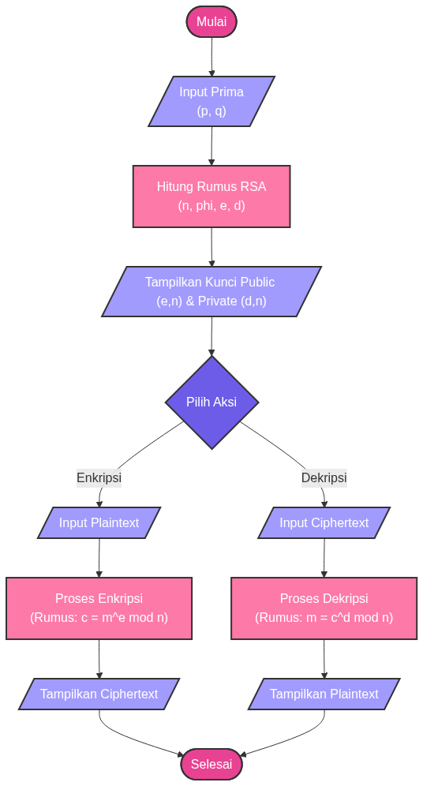

# IV. PEMBAHASAN

Pada aplikasi kriptografi RSA Crypt yang telah dikembangkan, terdapat beberapa antarmuka (interface) yang didesain untuk mempermudah pengguna dalam memahami dan menjalankan proses algoritma RSA. Aplikasi ini memvisualisasikan langkah-langkah matematis yang kompleks menjadi tampilan yang interaktif dan mudah dipahami.

## A) Alur Kerja Sistem (Flowchart)
Sebelum masuk ke antarmuka, alur kerja sistem secara keseluruhan digambarkan dalam bentuk diagram alir. Diagram ini menjelaskan logika proses mulai dari input bilangan prima, perhitungan kunci, hingga proses enkripsi dan dekripsi pesan, seperti terlihat pada Gambar 1.

*Gambar 1. Flowchart Alur Kerja Aplikasi RSA Crypt*

## B) Interface Pembangkitan Kunci (Key Generation)
Interface ini merupakan bagian utama yang digunakan untuk membangkitkan pasangan kunci RSA. Pada bagian ini, pengguna diminta untuk memasukkan dua bilangan prima ($ dan $). Sistem kemudian akan memproses input tersebut untuk menghasilkan Modulus ($), Public Exponent ($), dan Private Exponent ($).

Tampilan ini juga menyajikan langkah-langkah perhitungan secara detail (step-by-step), sehingga pengguna dapat melihat bagaimana nilai-nilai kunci tersebut diperoleh secara matematis, seperti terlihat pada Gambar 2.

*Gambar 2. Tampilan Proses Pembangkitan Kunci dan Langkah-langkah Perhitungan*

## C) Interface Enkripsi dan Dekripsi
Interface ini berfungsi sebagai tempat pengujian keamanan pesan. Setelah kunci berhasil dibangkitkan pada tahap sebelumnya, pengguna dapat memasukkan pesan teks (plaintext) pada kolom yang tersedia.

1.  **Bagian Enkripsi**: Menampilkan proses perubahan setiap karakter pesan menjadi kode ASCII, kemudian dihitung menjadi angka acak (ciphertext) menggunakan kunci publik.
2.  **Bagian Dekripsi**: Menampilkan proses pengembalian angka acak (ciphertext) menjadi pesan asli (plaintext) menggunakan kunci privat.

Interface ini didesain agar pengguna dapat membandingkan pesan asli dan pesan hasil enkripsi secara langsung, seperti terlihat pada Gambar 3.

*Gambar 3. Tampilan Hasil Enkripsi dan Dekripsi Pesan*
